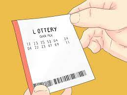
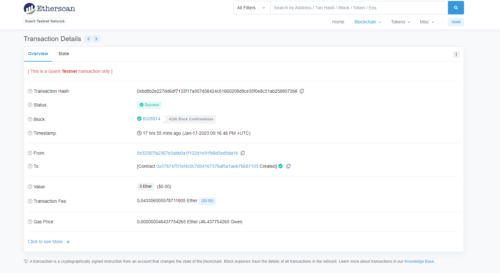

***
Smart Contract Projects Series | 1 - Lottery 
***

**The purpose of this project series is to present Smart Contracts with Solidity projects.**

 

 

  
   

 

Lottery smart contract basically; A lottery ticket is sold for a certain eth. The amount of money collected from ticket sales constitutes the total prize, and when certain conditions are met, the lucky person is randomly selected and receives half or a quarter of the prize depending on the type of ticket he buys. The remaining money from the prize money is transferred to the smart contract owner.

 

  
   

 

**Rules of Lottery**

<ul>
  <li>Smart Contract Owner cannot participate in the lottery</li>
  <li>There are 3 different ticket types in total: Full Ticket, Half Ticket, and Quarter Ticket.</li>
  <li>Participants can purchase a maximum of 3 tickets.</li>
  <li>The lucky winner is chosen completely at random and everyone has as many chances as the number of tickets bought.</li>
   <li>The prize money consists of the prices of the tickets sold.</li>
<li>Depending on the lucky ticket type, all, half or a quarter of the prize money is transferred to the ticket holder. The remaining prize money (if any) will be transferred to the contract holder's account.</li>

</ul>

 

**Experiment**

Lottery application was first written and tested via Remix online IDE. Then it was deployed to Goerli Testnet using JS and web3 library.

**Contract Address:** 0x57874701ef4C0C7D54167376af5A1aEb7B687103

  
   

 

**Project Content:**

- Fundemantel Solidity
- Function
- Mapping
- Array
- Constructor
- Struct
- Require
- Modifier
- Event
- Fundamantel JS
- web3 library | JS
- Basic Algorithm Knowlage

