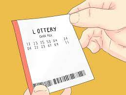
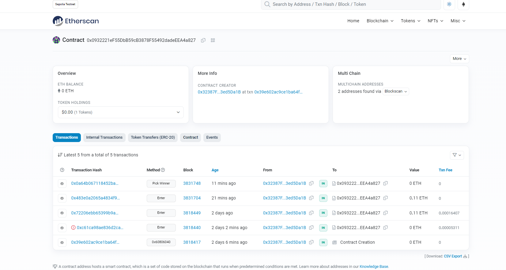

**_
Smart Contract Projects Series | 2 - Basic 
_**

**The purpose of this project series is to present Smart Contracts with Solidity projects.**

 

 

  
   

 

Lottery smart contract basically; A lottery ticket is sold for a certain eth. The amount of money collected from ticket sales constitutes the total prize, and when certain conditions are met, the lucky person is randomly selected and receives half or a quarter of the prize depending on the type of ticket he buys. The remaining money from the prize money is transferred to the smart contract owner.

 

  
   

 

**Experiment**

Lottery application was first written and tested via Remix online IDE. Then it was deployed to Goerli Testnet using JS and web3 library.

**Contract Address:** 0x0932221ef55dbb59cb3878f55492dadeeea4a827

  
   

 

**Project Content:**

- Fundemantel Solidity
- Function
- Mapping
- Array
- Constructor
- Struct
- Require
- Modifier
- Event
- Fundamantel JS
- web3 library | JS
- Basic Algorithm Knowlage
