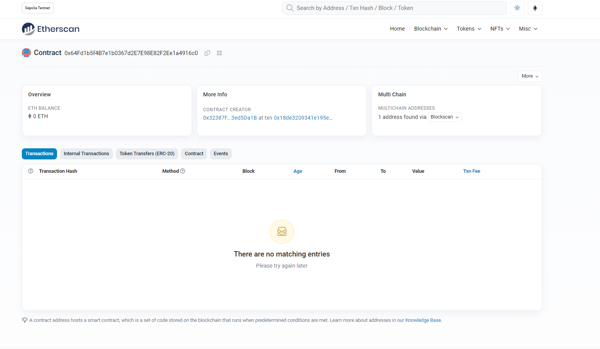

**_
Smart Contract Projects Series | 3 - Campaign 
_**

**The purpose of this project series is to present Smart Contracts with Solidity projects.**

 

 

  
   

 

0.8.18 Solidity version of Stephen Grider's Kickstart prep Campaign sample.

 

 

**Experiment**

Campaign application was first written and tested via Remix online IDE. Then it was deployed to Sepolia Testnet using JS and web3 library.

**Campaign Contract Address:** 0x64Fd1b5f4B7e1b0367d2E7E98E82F2Ee1a4916c0

  
   

 

**Project Content:**

- Fundemantel Solidity
- Function
- Mapping
- Array
- Constructor
- Struct
- Require
- Modifier
- Event
- Fundamantel JS
- web3 library | JS
- Basic Algorithm Knowlage
