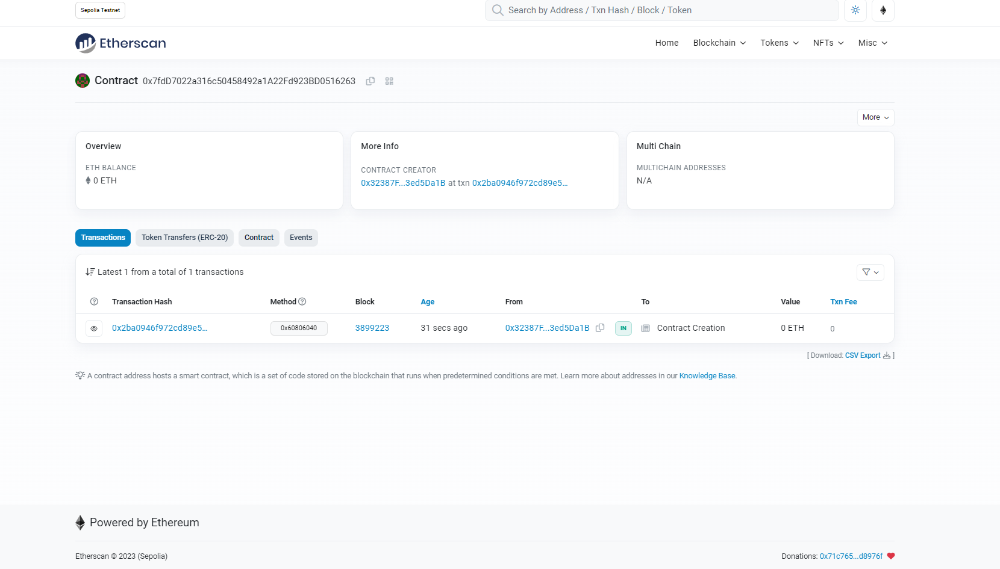

**_
Smart Contract Projects Series | 3 - Campaign 
_**

**The purpose of this project series is to present Smart Contracts with Solidity projects.**

 

 

  
   

 

In this application, a DApp Todo application has been made in the Ethereum network.

 

 

**Experiment**

Campaign application was first written and tested via Remix online IDE. Then it was deployed to Sepolia Testnet using JS and web3 library. Test functions are written using the Mocha framework

**Campaign Contract Address (Sepolia):** 0x7fdD7022a316c50458492a1A22Fd923BD0516263

  
   

 

**Project Content:**

- Fundemantel Solidity
- Nested Mapping
- Modifier
- Functions
- Events
- Enum
- web3.js
- mocha framework
